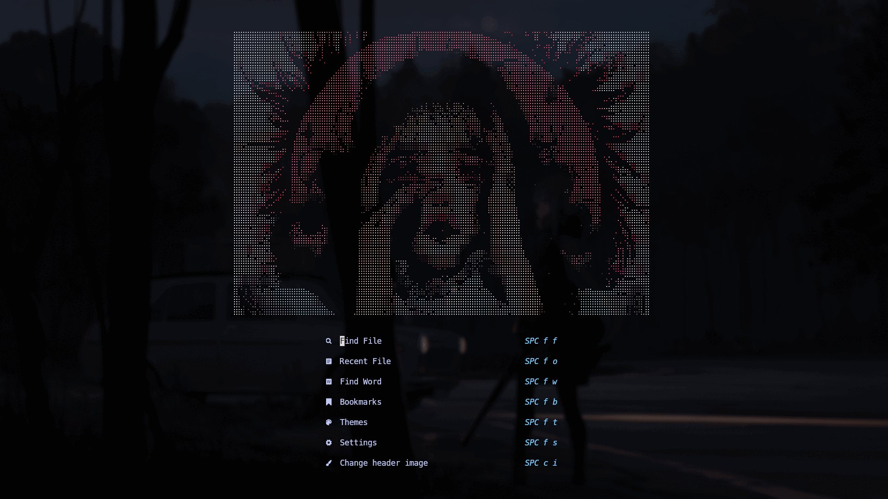
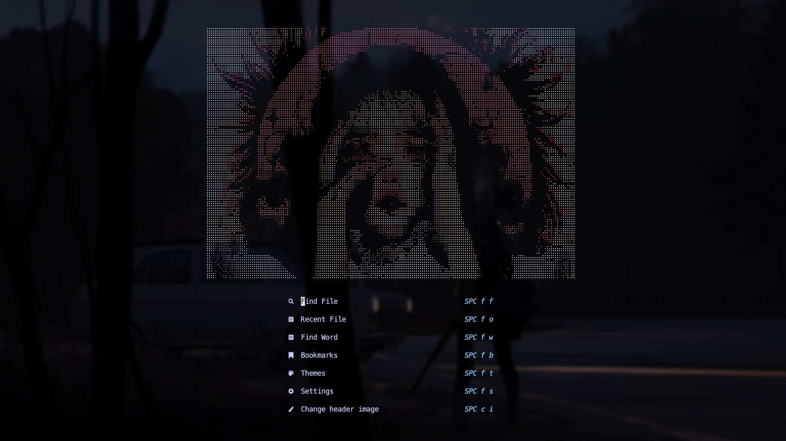
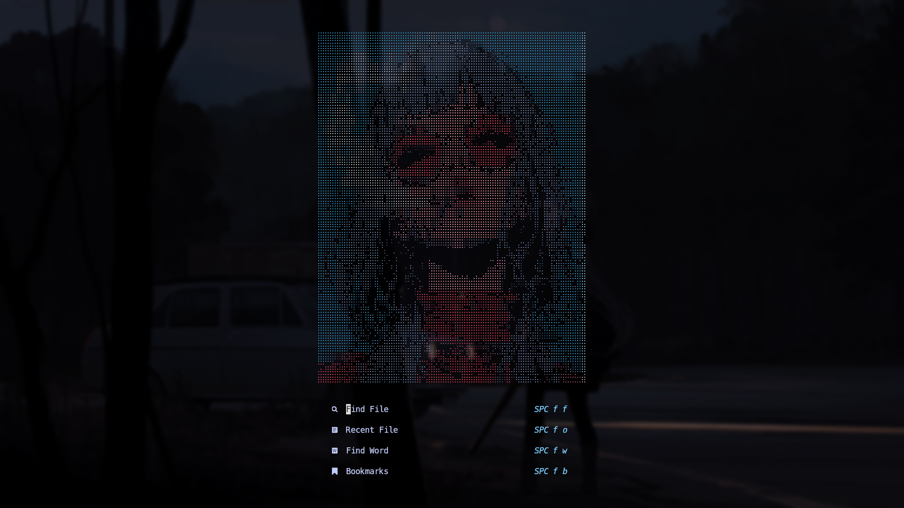
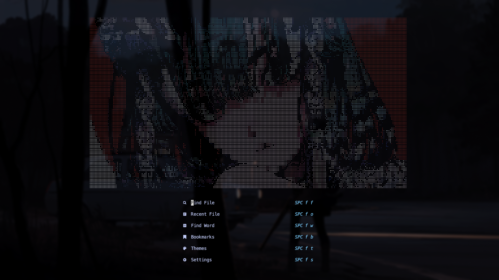
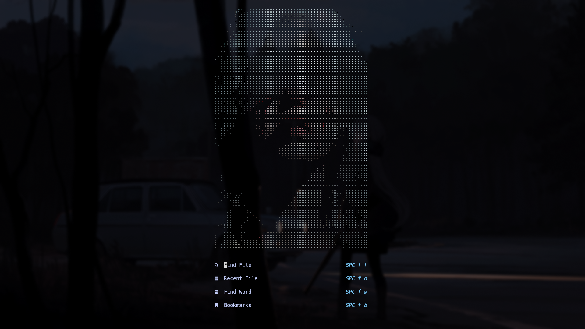
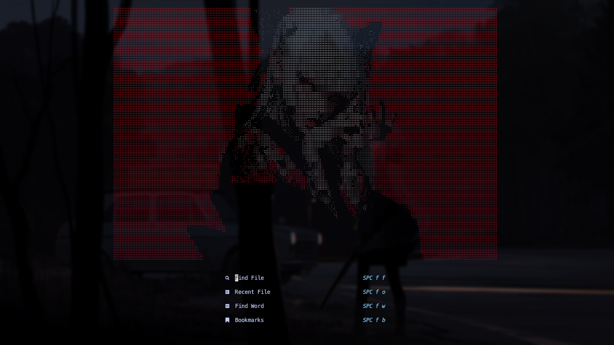

<p align='right'><em>Last updated: 2025-07-18 14:24 UTC+7</em></p>

# alpha-ascii.nvim

A simple plugin for [alpha-nvim ]("https://github.com/goolord/alpha-nvim") that provides custom ASCII headers for the dashboard screen.

## ✨ Preview

<div align="center">
  
</div>

<details><summary>Show individual screenshots</summary>

<div align="center">
  <table>
    <tr>
      <td align="center"><br/><sub><b>abstract_portrait</b></sub></td>
      <td align="center"><br/><sub><b>blue_bubblegum</b></sub></td>
      <td align="center"><br/><sub><b>calm_eyes</b></sub></td>
    </tr>
    <tr>
      <td align="center"><br/><sub><b>color_eyes</b></sub></td>
      <td align="center"><br/><sub><b>girl_bandaged_eyes</b></sub></td>
      <td align="center"><br/><sub><b>red_jpa</b></sub></td>
    </tr>
  </table>
</div>
</details>

## 📦 Installation

Use your favourite package manager and call the setup function.

```lua
-- lua with lazy.nvim
return {
    "goolord/alpha-nvim",
    event = "VimEnter",
    dependencies = {
        "nhattVim/alpha-ascii.nvim",
        opts = { header = "random" },
    },
    config = function()
        local alpha = require("alpha")
        local dashboard = require("alpha.themes.dashboard")

        dashboard.section.buttons.val = {
            dashboard.button("SPC f f", "  Find File  ", ":Telescope find_files<CR>"),
            dashboard.button("SPC f o", "  Recent File  ", ":Telescope oldfiles<CR>"),
            dashboard.button("SPC f w", "  Find Word  ", ":Telescope live_grep theme=ivy<CR>"),
            dashboard.button("SPC f b", "  Bookmarks  ", ":Telescope marks theme=ivy<CR>"),
            dashboard.button("SPC f t", "  Themes  ", ":Telescope colorscheme enable_preview=false<CR>"),
            dashboard.button("SPC f s", "  Settings", ":e $MYVIMRC | :cd %:p:h <CR>"),
            dashboard.button("SPC c i", "  Change header image", ":AlphaAsciiNext<CR>"),
        }

        vim.api.nvim_create_autocmd("User", {
            once = true,
            pattern = "LazyVimStarted",
            callback = function()
                local stats = require("lazy").stats()
                local ms = (math.floor(stats.startuptime * 100 + 0.5) / 100)
                dashboard.section.footer.val = {
                    " ",
                    " Loaded " .. stats.loaded .. "/" .. stats.count .. " plugins  in " .. ms .. " ms ",
                }
                pcall(vim.cmd.AlphaRedraw)
            end,
        })

        alpha.setup(dashboard.opts)
    end,
}
```

## ⚙️Configuration

```lua
opts = {
    -- Header name, use "random" for a random header
    header = "abstract_portrait",

    -- List of headers to exclude
    exclude = {
        "header_1",
        "header_2",
        -- ...
    },

    -- Path to your custom headers
    user_path = vim.fn.stdpath("config") .. "/ascii/",
}
```

## 🚀 Command

-   `AlphaAsciiNext` - Next header image
-   `AlphaAsciiPrev` - Previous header image
-   `AlphaAsciiRandom` - Random header image
-   `AlphaAsciiName` - Get current header name

## 🖼️ Generate Header Images

To generate header images, use [nxtkofi's img2art github repository](https://github.com/nxtkofi/img2art), a fork of [Asthestarsfalll's img2art github repository](https://github.com/Asthestarsfalll/img2art) project — it can speed up the process by 90%.

> [!Important]
> For advanced options and more details, see the original repo: [Asthestarsfalll's img2art github repository](https://github.com/Asthestarsfalll/img2art)
> Without his work, this project wouldn’t be possible 🙏.

1.  Clone nxtkofi's repository.

    ```
    git clone https://github.com/nxtkofi/img2art
    cd img2art
    ```

2.  Install dependencies

    ```
    python -m venv ./venv
    source venv/bin/activate
    pip install typer opencv-python numpy
    ```

3.  Generate your ASCII header

    ```
    poetry run python -m img2art.cli ~/path/to/picture.jpg --scale 0.3 --threshold 20 --save-raw ./test.lua --alpha
    ```

    Explanation:

    -   `--scale 0.3` This is scaling for our image. Pick a value so it fits into Your dashboard
    -   `-threshold 20` This is black-white threshold point. I suggest You play around it for a bit to see what's the best outcome for Your picture. Usually it's something between 20-150
    -   `./test.lua` This is where our output file will go and what name will it receive. Leave .lua extension. You may change the name.
    -   `--alpha` This makes sure that we get our picture in desired output style (ready to paste into alpha's dashboard!).

4.  Move the output file to your `ascii/` custom folder and reference it by name in the header config.

## 📊 Contributions


